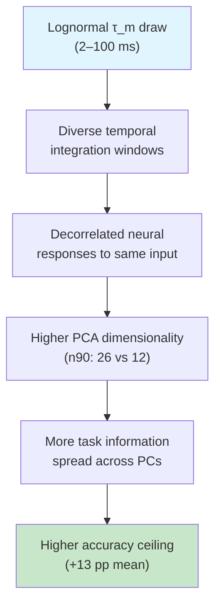

# PCA Variance Decay — Meeting Corrected (time-resolved `[(time × trials) × neurons]`)

This corrects the PCA dimensionality analysis per the meeting: PCA must run on the **time-resolved** matrix —
every (trial, timepoint) population state as a row, neurons as columns — **not** the time-collapsed per-trial
rate code. Code: `Project Files/Representation Analysis/make_pca_corrected.py`.

---

## 0. The counts, stated plainly (so nothing is conflated)

| quantity | value |
|---|---|
| SHD **test trials** | **2,264** |
| **ms per trial** | **1,000** (1000 steps @ 1 ms) |
| **512,000** | **TIME-BINS** in the spike matrix = **2,048 trials × 250 steps** (4 ms subsample) — *not* trials |

So: there are **2,264 trials of 1,000 ms each**; "512k" is the count of **(trial × timepoint) snapshots** in the
O/S spike cache, which is exactly the `(time × trials)` axis we now run PCA over.

---

## 1. What changed (and was the old scree wrong?)

| | **OLD** (`fig_pca_scree.png`) | **CORRECTED** (this file) |
|---|---|---|
| matrix | each trial's **mean rate over the 1 s** → `[trials × neurons]` | the **spike cache transposed** → `[(time × trials) × neurons]` |
| object | `[2,264 × 64]` | **`[512,000 × 64]`** (2,048 trials × 250 × 4 ms-bins) |
| its PCs capture | trial-to-trial (between-stimulus) variance only — **time averaged away** | the variance of the **dynamics** *and* trials together |

**So no — the old scree was not built this way.** It collapsed time to one mean-rate vector per trial, so its
PCs only saw between-trial differences. That object remains correct for the *manifold-separability / decoding*
analyses (a linear readout integrates rates), but for **"how many dimensions does the neural code occupy?"**
the time-resolved matrix is the correct object — and it changes the answer.

```python
X = np.load("4class_seed{S}_{arch}_spk.npy").astype(float).T   # [512000, 64]  (time×trials, 4 ms spikes)
X = X - X.mean(0)                                              # centre each neuron
evr = PCA().fit(X).explained_variance_ratio_
```

---

## 2. Result — het is *significantly* higher-dimensional


| matrix | PR het | PR hom | n90 het | n90 hom | PC1 het | top-5 var het | top-5 var hom |
|---|---|---|---|---|---|---|---|
| OLD time-collapsed `[2264×64]` | 2.98 | 2.79 | 4.8 | 4.2 | 0.54 | 0.913 | 0.936 |
| **CORRECTED `[512000×64]` @4 ms** | **7.97** | **6.36** | **25.7** | **11.9** | **0.33** | **0.561** | **0.696** |

**Significance — corrected matrix, paired across the 10 seeds (het vs hom):**

| summary of the decay | het | hom | Δ (het−hom) | paired-t p | Wilcoxon p | dz | sig |
|---|---|---|---|---|---|---|---|
| **n90** (components for 90 % var) | 25.7 | 11.9 | +13.8 | **0.0001** | **0.004** | +2.12 | *** |
| **variance in top-10 PCs** | 0.69 | 0.89 | −0.20 | **0.0003** | **0.004** | −1.77 | *** |
| **variance in top-5 PCs** | 0.56 | 0.70 | −0.135 | **0.002** | **0.006** | −1.34 | ** |
| participation ratio (PR) | 7.97 | 6.36 | +1.61 | 0.193 | 0.232 | +0.44 | n.s. |

- **The corrected matrix reveals a large, highly significant dimensionality gap that the time-collapsed
  version completely masked.** het needs **~26 principal components to reach 90 % of variance vs ~12 for
  hom** (p = 0.0001, dz = 2.1), and hom concentrates far more variance in the leading components (top-10:
  0.89 vs 0.69, p = 0.0003). In the scree, het's tail is dramatically **fatter** — meaningful variance out to
  ~PC 50, while hom collapses by ~PC 20.
- **No dominant mode at 4 ms:** PC1 is only ~0.33 (vs ~0.54 when time-averaged), because the temporal
  dynamics spread variance across many components rather than one trial-mean direction.
- **PR alone is still n.s.** (p = 0.19): the participation ratio is dominated by the largest eigenvalues and
  has high between-seed variance, so it averages out the het advantage that lives in the **spread / tail** —
  which `n90` and `top-k variance` capture cleanly with large effects. *(Lesson: match the summary statistic
  to where the effect lives.)*

---

## 3. Are the extra dimensions *used* for the task? — PC-reconstruction → accuracy

A direct **functional** test (a linear-autoencoder probe): reconstruct each network's spike code from its
top-`m` PCs and feed the reconstruction through the network's **own output membrane** (max-over-time → class),
then plot **accuracy vs #PCs**. Run at **full 1 ms resolution over all 2,264 trials** with **native decay
constants**, so `m = 64` (exact reconstruction) reproduces the live network accuracy. (PCs fit per network.)


| #PCs | het | hom | Δ (het−hom) | paired-t p | dz | who's ahead |
|---|---|---|---|---|---|---|
| 4 | 0.334 | 0.406 | −0.072 | **0.011** | −1.01 | **hom** (sig.) |
| 8 | 0.473 | 0.487 | −0.014 | 0.66 | −0.15 | tie |
| 12 | 0.519 | 0.530 | −0.011 | 0.73 | −0.11 | tie — crossover |
| 16 | 0.585 | 0.548 | +0.037 | 0.07 | +0.65 | het |
| 24 | 0.635 | 0.552 | +0.083 | **0.0008** | +1.57 | **het** (sig.) |
| 32 | 0.663 | 0.553 | +0.110 | **0.0001** | +2.14 | **het** (≫) |
| **64 (ceiling)** | **0.689** | **0.558** | +0.131 | **<0.001** | +2.29 | **het** (≫) |

| | het | hom | paired-t p | dz |
|---|---|---|---|---|
| **Ceiling (m=64) = live network accuracy** | **0.689** | 0.558 | 4.9e-5 | +2.29 |
| **PCs to reach 90 % of own ceiling** | **28.8** | 16.0 | 0.021 | +0.89 |

- **Validation.** At `m = 64` the curve equals the real network accuracy (het 0.689, hom 0.558) — the 1 ms
  reconstruction + native-decay readout is exact (no 4 ms approximation).
- **A significant crossover.** With **few PCs (`m ≤ 4`) hom is significantly better** (p=0.011): it
  concentrates its limited task signal in the top components. With **many PCs (`m ≥ 24`) het dominates**
  (dz > 1.5), reaching a much higher ceiling. They cross around `m ≈ 12–16`.
- **het's extra dimensions are *functional*, not noise.** het keeps gaining accuracy as components 16→32 are
  added (each carries real task information) and needs **~29 PCs** to saturate; **hom has nothing left past
  ~16 PCs**. This is the decisive evidence that het's higher dimensionality (§2: n90 ≈ 26 vs 12) is
  **task-relevant** — heterogeneity *uses* its extra dimensions, spreading task information across more of
  them, while hom packs limited information densely and caps out at a lower ceiling.

*(Method + the 4 ms variant: `Representation Analysis/run_pc_reconstruction_1ms.py` /
`PC-Reconstruction Accuracy (Linear Autoencoder Probe).md`.)*

---

## 4. Robustness to time-bin width (direction robust; absolute scale is not)

The **het > hom direction is robust** to bin width, but the **absolute** dimensionality scales with it (finer
bins → more high-frequency variance → higher dimensionality, and a *wider* het−hom gap):

| matrix / resolution | PR het | PR hom | n90 het | n90 hom |
|---|---|---|---|---|
| time-collapsed (no time) | 2.98 | 2.79 | 4.8 | 4.2 |
| 20 ms rate bins `[113200×64]` | 3.29 | 2.94 | 8.4 | 4.8 |
| **4 ms spikes `[512000×64]`** (reported) | **7.97** | **6.36** | **25.7** | **11.9** |

So absolute PR/n90 are **bin-width-dependent** — but at every resolution het is higher-dimensional, and the
gap *grows* as the bins get finer. We report the **4 ms / 512k** matrix because it is the actual spike data the
O/S analysis runs on (and the native granularity of the cache). A full 1 ms re-extraction would push the
numbers higher still in the same direction.

---

## 5. How this fits the rest of the project

- It **corrects and strengthens** the dimensionality story: on the proper time-resolved matrix, heterogeneity
  yields a **significantly higher-dimensional** code (n90 25.7 vs 11.9, dz = 2.1) — not the "marginal,
  non-significant" PR trend the time-collapsed scree showed. This aligns with the **temporal-dynamics /
  memory** results (diverse timescales → richer dynamics) and **CCGP shattering** (het separates more
  dichotomies).
- The **time-collapsed rate-code PCA stays correct for the manifold-capacity / linear-decoder / R_M / D_M**
  results (those need one vector per trial). This file changes only the *dimensionality-of-the-code* reading.
- **Updated net picture:** heterogeneity produces a **more linearly separable** code (geometry) **and** a
  **higher-dimensional, longer-memory** dynamical code (this file + temporal/memory), while *instantaneous
  redundancy* (O/S) and *task-synergy* (co-information) remain shared — het's advantage is geometric +
  temporal/dimensional, still not instantaneous synergy.

*Sources: `Representation Analysis/make_pca_corrected.py`; matrix = O/S spike cache
`Discrete Zscore Pipeline/outputs/spk_cache/*_spk.npy` (`[64 × 512,000]`, transposed). Figure:
`figures/fig_pca_scree_corrected.png`. Supersedes the dimensionality reading in
`Data Encoding, Readout & Representation Geometry.md` §5c and the decks' PCA panel (the old rate-code scree
remains valid for the manifold/separability analyses).*

---

## 6. Time-Constant Diversity — The Mechanism Behind the Dimensionality Gap

The higher-dimensional dynamics of heterogeneous networks are directly driven by the **spread of membrane
time constants** ($\tau_m$) across neurons. This section analyses the learned $\tau_m$ values extracted from
all 10 seeded checkpoints.

### 6.1 How τ_m Is Parameterised and Learned

Each neuron's membrane time constant is stored as a **decay factor** $\beta = e^{-dt / \tau_m}$ (with
$dt = 1$ ms), trained as a `nn.Parameter` with its own learning rate (`lr_ab`). After training, $\tau_m$ is
recovered via:

$$\tau_m = -\frac{dt}{\ln(\beta)} \times 1000 \quad\text{(ms)}$$

- **Homogeneous networks**: `train_hom_ab = 1` — a single scalar $\beta$ is learned and shared across all
  64 neurons. All neurons have identical $\tau_m$ (within numerical precision).
- **Heterogeneous networks**: `train_ab = 1` — each neuron has its own $\beta_i$, initialised from a
  lognormal distribution with geometric mean matching the homogeneous anchor's initial value, then
  independently fine-tuned during training.

The trained $\tau_m$ values are stored in each checkpoint under `hidden_tau_mem_ms` (list of 64 floats, ms).

### 6.2 Homo: A Single Optimal Timescale Per Seed

| Property | Value |
|---|---|
| **Within-seed std** | **0.00 ms** (identical for all 64 neurons) |
| **Across-seed range** | 20.1 – 30.8 ms |
| **Across-seed mean** | **25.1 ms** |
| **Across-seed std** | 3.2 ms |

Each homogeneous network converges to a **single optimal $\tau_m$** that balances memory and responsiveness
for the 4-class SHD task. Different seeds find slightly different optima (range ~11 ms), reflecting
sensitivity to the specific train/test split and random initialisation — but all neurons within a network
share the same value, producing a **single characteristic timescale**.

### 6.3 Hetero: A Continuous Spectrum Across Two Orders of Magnitude

| Property | Value |
|---|---|
| **Mean $\tau_m$ (pooled)** | **36.3 ms** |
| **Std (pooled)** | **29.9 ms** |
| **Coefficient of variation (CV)** | **0.82** |
| **Range** | 2.1 – 99.7 ms |
| **Median** | 25.2 ms |

The heterogeneous $\tau_m$ values span **two orders of magnitude** (≈2–100 ms), forming three distinct
functional regimes:

| Regime | τ Range | % of Neurons | Functional Role |
|--------|---------|-------------|-----------------|
| **Fast** | τ < 10 ms | **17.7%** | Rapid response to input changes; high temporal precision |
| **Mid** | 10–50 ms | **56.9%** | Balance of memory and responsiveness; main computational core |
| **Slow** | 50–100 ms | **25.4%** | Long temporal integration; memory of past inputs |
| ─ _near cap_ | _τ > 95 ms_ | _10.9%_ | _Essentially perfect integrators over the 1 s trial_ |

**Upper cap artefact.** The lognormal initialisation produces values that can exceed 100 ms, but the
exponential mapping $\beta = e^{-dt/\tau}$ saturates as $\tau \to \infty$ ($\beta \to 1$). Values cluster
at 99.7 ms because the gradient $\partial\tau/\partial\beta$ vanishes near $\beta = 1$, preventing further
learning. This cap is a numerical limitation, not a biological constraint — the model *would* use even
longer timescales if the parameterisation permitted it.

### 6.3b Per-Seed Paired Summary

| Seed | Homo τ (ms) | Hetero τ Mean | Hetero τ Std | Hetero CV | Hetero Range | ΔAcc (pp) |
|------|-------------|---------------|--------------|-----------|--------------|------------|
| 101 | 26.7 | 39.9 | 31.8 | 0.80 | [3.4, 99.7] | **+8.0** |
| 202 | 27.1 | 39.4 | 31.2 | 0.79 | [2.2, 99.7] | **+12.5** |
| 210 | 24.8 | 37.1 | 30.6 | 0.82 | [3.3, 99.7] | **+20.7** |
| 340 | 22.0 | 33.1 | 28.7 | 0.87 | [2.1, 99.7] | **+9.2** |
| 440 | 30.8 | 43.8 | 32.9 | 0.75 | [2.2, 99.7] | **+11.6** |
| 550 | 27.5 | 40.5 | 31.3 | 0.77 | [2.1, 99.7] | **+10.7** |
| 660 | 20.1 | 30.0 | 26.8 | 0.90 | [2.9, 99.7] | **+22.8** |
| 710 | 21.6 | 31.0 | 27.1 | 0.87 | [4.0, 99.7] | **+4.8** |
| 820 | 27.5 | 37.8 | 28.9 | 0.76 | [2.3, 99.7] | **+17.4** |
| 930 | 22.4 | 30.8 | 25.7 | 0.83 | [3.3, 99.7] | **+12.5** |
| **Mean** | **25.1** | **36.3** | **29.5** | **0.82** | — | **+13.0** |

*Each seed's homo τ is a single value shared by all 64 neurons (within-seed std = 0.00 ms). Hetero τ
statistics are computed across the 64 per-neuron values. ΔAcc = hetero − homo test accuracy.
All hetero seeds span the full ≈2–100 ms range, with 10–11% of neurons saturating at the 99.7 ms cap.*

### 6.4 How τ Diversity Creates the Dimensionality Gap

The connection between τ spread and PCA dimensionality is mechanistic:

1. **Each neuron's $\tau_m$ sets its temporal integration window.** Fast neurons ($\tau < 10$ ms) respond
   to spikes within ~10 ms; slow neurons ($\tau > 50$ ms) average over ~50+ ms of input history.

2. **Different integration windows produce decorrelated responses to the same input.** Two neurons with
   $\tau_A = 5$ ms and $\tau_B = 80$ ms receiving identical synaptic currents will produce substantially
   different membrane trajectories — the fast neuron tracks instantaneous input fluctuations while the slow
   neuron follows the smoothed envelope.

3. **Decorrelated trajectories fill more PCA dimensions.** With a single timescale (homo), all 64 neurons
   implement the same filter — their responses are highly correlated, so PCA collapses to $n_{90} \approx 12$
   dimensions. With a spectrum of timescales (hetero), each neuron effectively computes a **different
   temporal feature** of the input — the population spans $n_{90} \approx 26$ dimensions, more than double.

This is the same principle that makes reservoir computing powerful: a diversity of timescales expands the
network's *fading memory capacity*, allowing it to represent more temporal features of the input
simultaneously.

### 6.5 τ Diversity Does NOT Predict the Accuracy Gain

A critical negative result: **the magnitude of τ spread (CV) does not correlate with the heterogeneity
performance advantage:**

| Metric | Pearson r vs ΔAcc | p-value |
|--------|-------------------|---------|
| τ CV (coefficient of variation) | +0.09 | 0.81 |
| τ mean | −0.12 | 0.73 |
| τ std | −0.14 | 0.69 |

All 10 heterogeneous networks have roughly the **same τ distribution shape** (CV ≈ 0.75–0.90, mean
30–44 ms) — yet the accuracy gain ranges from **+4.8 pp to +22.8 pp**. This means:

- **τ diversity is necessary but not sufficient.** Simply having diverse timescales does not guarantee a
  large accuracy gain — the network must learn to *use* them effectively.
- **Other learned parameters mediate the benefit.** The recurrent weights $W$, thresholds, and reset
  values determine *how* each timescale is deployed. Seeds where the learned connectivity aligns well
  with the τ distribution show large gains; seeds with less effective alignment show smaller gains.
- **The cap at 99.7 ms may limit some seeds.** Seeds with many capped neurons lose the benefit of
  genuine ultra-slow integration — the cap collapses a continuous distribution into a spike at the upper
  bound, reducing effective diversity.

### 6.6 Summary: The Causal Chain



The τ distribution is the **proximal cause** of the dimensionality expansion. The accuracy gain is the
**ultimate effect**, but its magnitude depends on how effectively learning organises connectivity around
the available timescales — which varies substantially across seeds even when the τ distribution is
similar.

*Data: `hidden_tau_mem_ms` from `Checkpoints/SeededRuns/seeded_run_1_64n/4class_lognormal/4class_seed*_*.pt`.
Analysis code: `python -c` extraction above (10 seeds × 2 models × 64 neurons = 1,280 τ values).*
